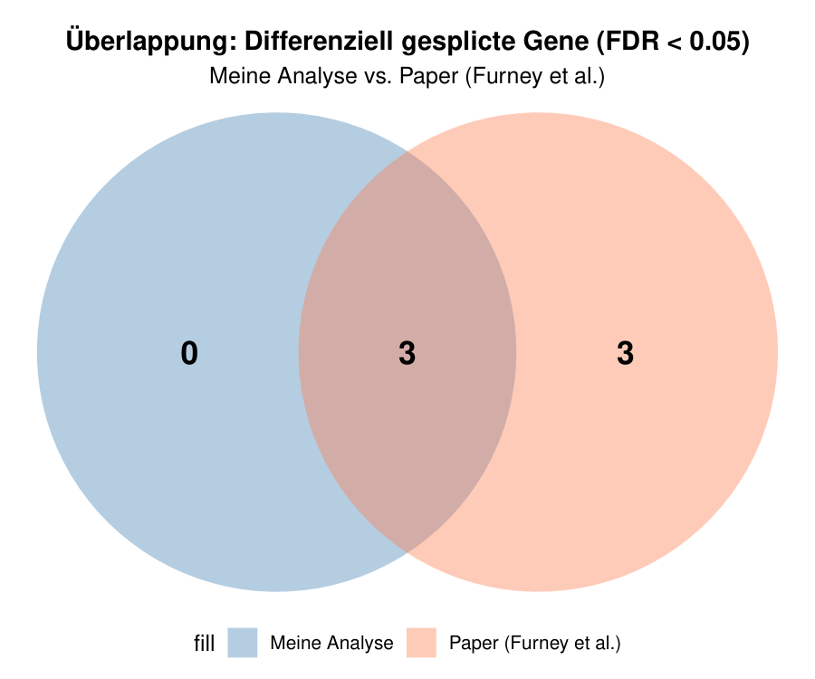
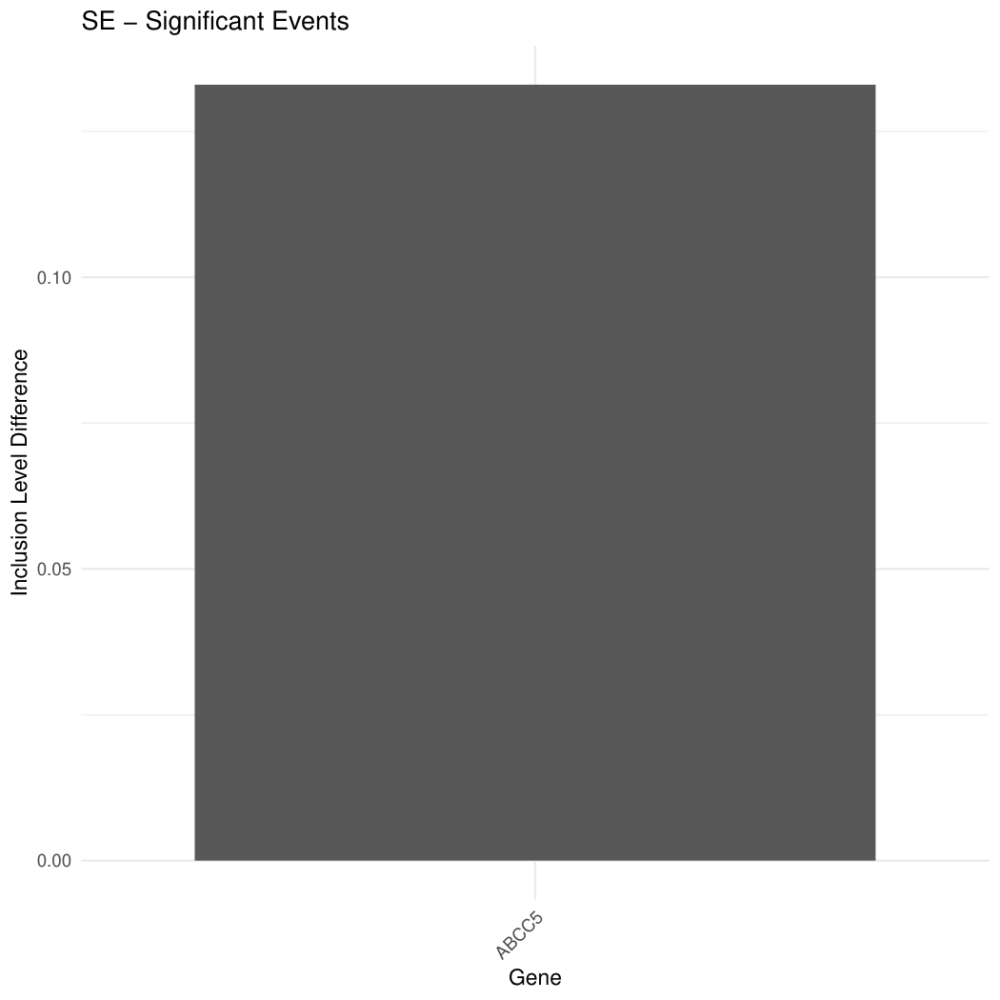
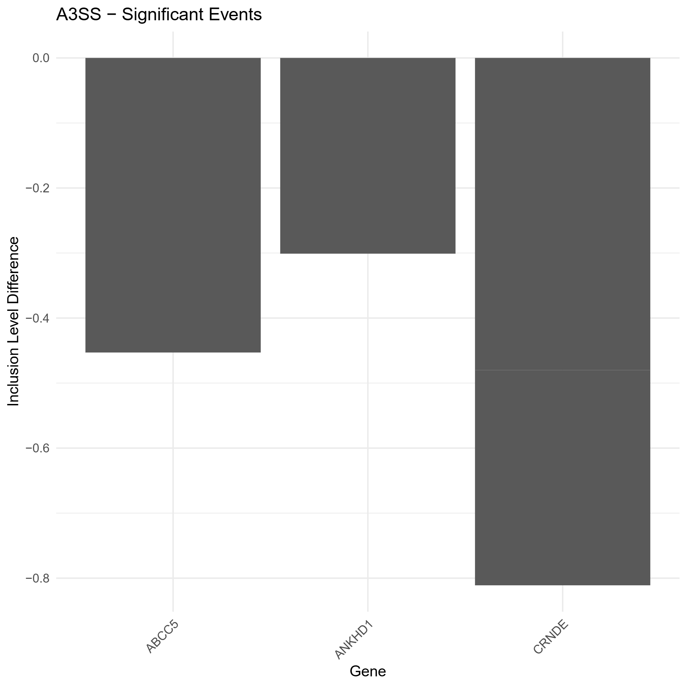
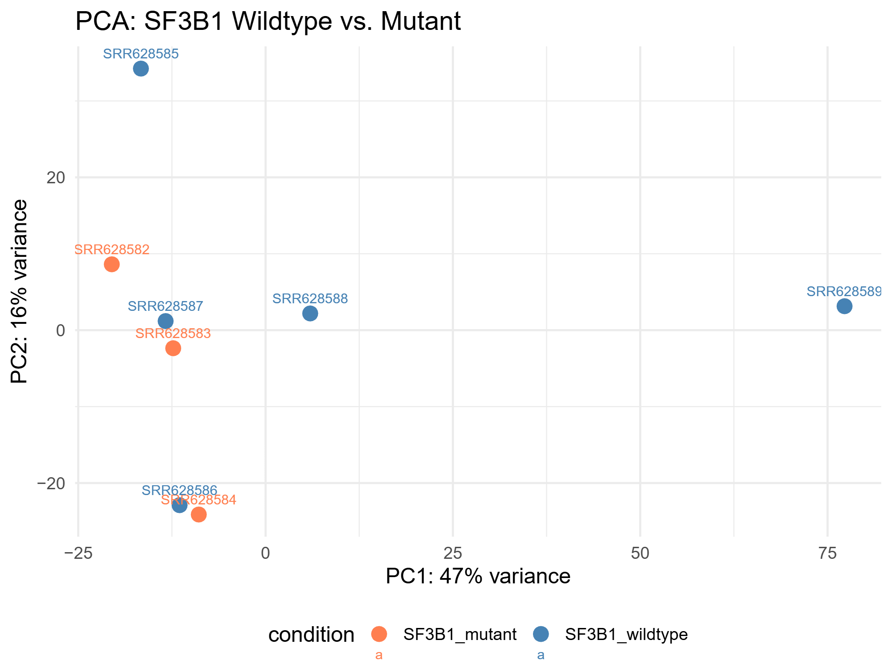

# Report  &mdash; Subject 1
## Baseline Situation
HHarbour, J. William et al. performed RNA sequencing on biological samples obtained from patients suffering from uveal melanoma, the most common primary malignancy of the
eye, which is frequently associated with the development of fatal metastases.

Uveal melanoma represents one of the few cancer types that show a strong association with mutations in the SF3B1 gene. SF3B1 encodes a core component of the spliceosome and
plays a crucial role in the recognition of splice sites during pre-mRNA processing. Given this central function, mutations in SF3B1 are expected to have a direct impact on
RNA splicing.

Surprisingly, the original study by Harbour, J. William et al. did not report substantial splicing differences between SF3B1-mutated and non-mutated samples. However, a
subsequent re-analysis of the same RNA-seq datasets by Furney, Simon J. et al. identified multiple genes exhibiting differential alternative splicing between the two
conditions. Among the genes reported were:
- ABCC5
- CRNDE
- UQCC
- GUSBP11
- ANKHD1
- ADAM12

These contrasting findings highlight the potential influence of analytical strategies and methodological choices on the detection of splicing alterations.

## Our Analysis
### Basics
WThe aim of this project was to reproduce, as closely as possible, the results reported by Furney, Simon J. et al. using an independently implemented analysis pipeline. The
pipeline consisted of the following main steps:
1. **Quality Control** &mdash; FastQC was used to assess the quality of raw FASTQ files
2. **Alignment** &mdash; HISAT2 was applied for mapping reads to the reference genome
3. **Quantification** &mdash; featureCounts was used to obtain gene-level read counts
4. **Splicing analysis** &mdash; rMATS was employed to detect differential alternative splicing events

This workflow reflects commonly used best practices in RNA-seq data analysis and allows for a systematic comparison with previously published results.

### Our results
A summary of the rMATS output is shown below:

```
EventType	EventTypeDescription	TotalEventsJC	TotalEventsJCEC	SignificantEventsJC	SigEventsJCSample1HigherInclusion	SigEventsJCSample2HigherInclusion	SignificantEventsJCEC	SigEventsJCECSample1HigherInclusion	SigEventsJCECSample2HigherInclusion
SE	skipped exon	38410	40056	583	286	297	708	374	334
A5SS	alternative 5' splice sites	4805	4856	114	74	40	160	110	50
A3SS	alternative 3' splice sites	7408	7439	297	198	99	324	216	108
MXE	mutually exclusive exons	4726	5021	72	43	29	93	57	36
RI	retained intron	6468	6575	447	355	92	657	539	118
```

Each row corresponds to a distinct type of alternative splicing event:
- SE (Skipped Exon) &mdash; an exon is included in one condition and skipped in another
- A5SS &mdash; alternative 5′ splice site usage
- A3SS &mdash; alternative 3′ splice site usage
- MXE &mdash; mutually exclusive exons (only one of two exons is included)
- RI (Retained Intron) &mdash; an intron remains in the mature RNA

Overall, the rMATS results indicate widespread alternative splicing, with skipped exon events representing the dominant class. This observation is consistent with previous
studies showing that exon skipping is the most prevalent splicing mechanism in mammalian transcriptomes. Although tens of thousands of potential events were detected, only
a relatively small fraction reached statistical significance, which is typical for RNA-seq–based splicing analyses.

As our primary objective was to reproduce the findings of Furney, Simon J. et al., we restricted our downstream analysis to the genes reported in their study. After
filtering for these candidates, we detected differential splicing events in three out of the six genes described previously:
**ABCC5**, **ANKHD1** and **CRNDE**.



More specifically, we observed skipped exon events in ABCC5, as well as alternative 3′ splice site usage in ANKHD1, CRNDE and ABCC5.





In addition to splicing-specific analyses, we performed a principal component analysis (PCA) based on expression data. The PCA shows a
partial separation between SF3B1-mutated samples and wild-type controls, indicating systematic transcriptomic differences between the two groups.



### Conclusion
Even though we were not able to precisely reproduce the results reported by Furney, Simon J. et al., our analysis pipeline was nevertheless able to identify several genes
that appear to be affected by alternative splicing in the context of SF3B1 mutations. While the overlap with the originally published results was halfed, the detection of
overlapping candidate genes indicates that our approach is capable of capturing biologically relevant splicing alterations.

Importantly, the observation of promising results obtained through two independent analytical strategies further supports the assumption that SF3B1 mutations are associated
with a substantial number of alternative splicing events. This consistency across different methodological approaches strengthens the overall confidence in the biological
relevance of the observed effects, even in the absence of a full replication of the original study.

Taken together, these findings suggest that re-analyzing or re-evaluating previously published results can be a valuable strategy, particularly when there is uncertainty
regarding the original analytical methods or data processing choices. Independent validation using alternative pipelines may therefore contribute to a more robust and
nuanced interpretation of complex phenomena such as mutation-associated splicing changes.

## References
Furney SJ, Pedersen M, Gentien D, Dumont AG, Rapinat A, Desjardins L, Turajlic S, Piperno-Neumann S, de la Grange P, Roman-Roman S, Stern MH, Marais R. SF3B1 mutations are associated with alternative splicing in uveal melanoma. Cancer Discov. 2013 Oct;3(10):1122-1129. doi: 10.1158/2159-8290.CD-13-0330. Epub 2013 Jul 16. PMID: 23861464; PMCID: PMC5321577.

Harbour JW, Roberson ED, Anbunathan H, Onken MD, Worley LA, Bowcock AM. Recurrent mutations at codon 625 of the splicing factor SF3B1 in uveal melanoma. Nat Genet. 2013 Feb;45(2):133-5. doi: 10.1038/ng.2523. Epub 2013 Jan 13. PMID: 23313955; PMCID: PMC3789378.
