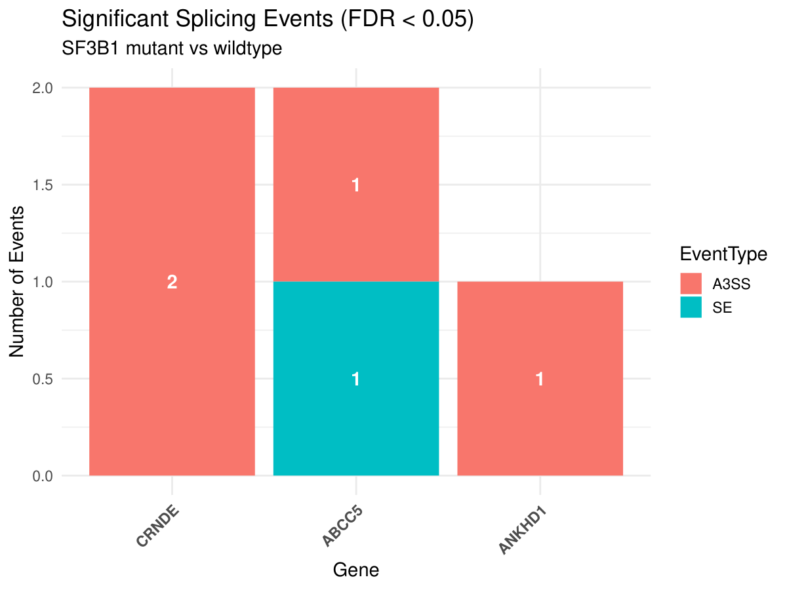

# Report: SF3B1-associated splicing in uveal melanoma

## Background

Uveal melanoma is the most common primary cancer of the eye in adults, and about half of all patients go on to develop metastases. It is also one of the few tumour types in which the splicing factor **SF3B1** is recurrently mutated, almost always at codon R625. Because SF3B1 is part of the core spliceosome and helps recognise the branch point and 3′ splice site, a mutation there should leave a visible mark on the transcriptome.

Two studies looked at the same public RNA-seq data and came to different conclusions:

- **Harbour et al. (2013)** reported the SF3B1 R625 mutations but found no substantial splicing differences between mutant and wild-type tumours.
- **Furney et al. (2013)** re-analysed the data with a splicing-focused approach and reported differential alternative splicing in several genes, including **ABCC5, CRNDE, UQCC, GUSBP11, ANKHD1** and **ADAM12**.

The question for this project: with a current, independently built pipeline, which of the two results can be reproduced?

## Data and methods

Eight samples from the Harbour et al. dataset (SRA runs SRR628582–SRR628589): three SF3B1-mutant and five SF3B1-wild-type tumours, paired-end reads.

The analysis runs as a Nextflow pipeline (`main.nf`):

| Step | Tool | Output |
|---|---|---|
| Quality control | FastQC | per-sample QC reports (`results/fastqc/`) |
| Alignment | HISAT2 (GRCh38) | sorted BAM files |
| Gene quantification | featureCounts | gene-level counts (`results/counts/`) |
| Differential splicing | rMATS (mutant vs. wild type) | event tables per splicing type (`results/rmats/`) |

Downstream analyses in R (`analysis_scripts/`): PCA on the count matrix, Venn comparison with the genes from Furney et al., and plots of the significant rMATS events. Events count as significant at FDR < 0.05.

## Results

### Genome-wide splicing events

rMATS tested roughly 62,000 events. Counted on junction reads (JC) and on junction plus exon-body reads (JCEC):

| Event type | Tested (JC) | Significant (JC) | Significant (JCEC) |
|---|---:|---:|---:|
| SE – skipped exon | 38,410 | 583 | 708 |
| RI – retained intron | 6,468 | 447 | 657 |
| A3SS – alternative 3′ splice site | 7,408 | 297 | 324 |
| A5SS – alternative 5′ splice site | 4,805 | 114 | 160 |
| MXE – mutually exclusive exons | 4,726 | 72 | 93 |

Skipped exons are the largest class in absolute numbers, as expected for mammalian transcriptomes. Relative to the number of tested events, however, **A3SS** and **RI** events are enriched among the significant hits (about 4 % and 7 % of tested events vs. 1.5 % for SE). The A3SS enrichment matches the known mechanism of mutant SF3B1, which selects cryptic 3′ splice sites shortly upstream of the canonical one. For A3SS, about two thirds of the significant events have higher inclusion in the mutant group.

### Comparison with Furney et al.

Of the six genes reported by Furney et al., three show a significant event in this analysis: **ABCC5, ANKHD1** and **CRNDE**.

| Gene | Event | ΔPSI (IncLevelDifference) | FDR |
|---|---|---:|---:|
| CRNDE | A3SS | −0.48 | 2.5 × 10⁻⁴ |
| CRNDE | A3SS | −0.33 | 6.4 × 10⁻³ |
| ABCC5 | A3SS | −0.45 | 7.9 × 10⁻⁴ |
| ANKHD1 | A3SS | −0.30 | 5.9 × 10⁻³ |
| ABCC5 | SE | 0.13 | 1.2 × 10⁻² |

Four of the five hits are alternative 3′ splice site events with large PSI shifts (30–48 percentage points). This is the splicing pattern Furney et al. describe for SF3B1-mutant tumours. UQCC, GUSBP11 and ADAM12 did not reach significance.

### Gene expression (PCA)

At the gene-expression level, mutant and wild-type samples do **not** separate: the three mutant samples fall among the wild-type samples on PC1 and PC2. PC1 (47 % of variance) is dominated by a single wild-type sample (SRR628589). This fits the picture from both papers. SF3B1 mutations change isoform composition rather than overall gene expression, so a gene-level analysis like the one in Harbour et al. can easily miss them.

## Conclusion

The re-analysis supports Furney et al.: SF3B1-mutant uveal melanomas show differential splicing, dominated by alternative 3′ splice site usage. Half of the previously reported genes (ABCC5, ANKHD1, CRNDE) were reproduced with an independent pipeline, each with large effect sizes. Gene-level expression, in contrast, does not distinguish the two groups, which explains why the original gene-focused analysis found no effect.

Limitations: with three mutant samples the statistical power is low, which probably explains why the remaining three genes were not reproduced. The PCA also shows one strong outlier sample. Differences in reference annotation and tool versions compared with 2013 may shift individual events as well.

## References

Furney SJ, Pedersen M, Gentien D, et al. SF3B1 mutations are associated with alternative splicing in uveal melanoma. *Cancer Discov.* 2013;3(10):1122–1129. doi:10.1158/2159-8290.CD-13-0330

Harbour JW, Roberson ED, Anbunathan H, Onken MD, Worley LA, Bowcock AM. Recurrent mutations at codon 625 of the splicing factor SF3B1 in uveal melanoma. *Nat Genet.* 2013;45(2):133–135. doi:10.1038/ng.2523
